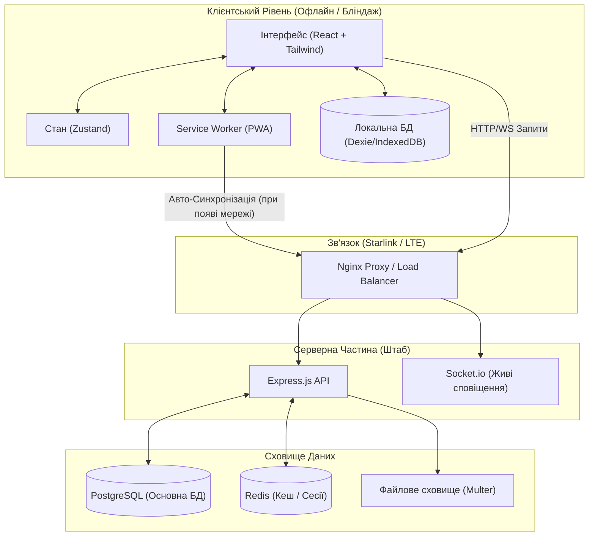
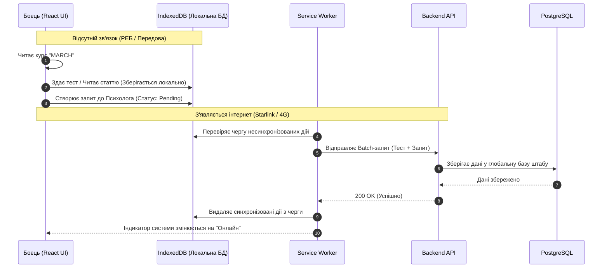
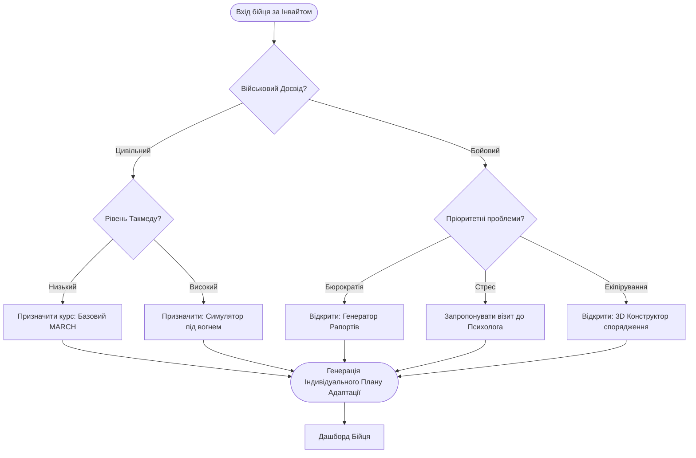
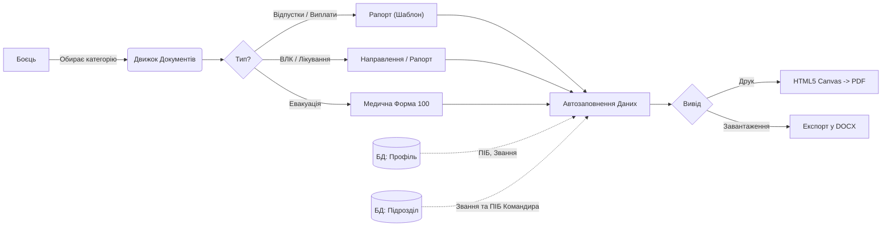

# ⚔️ MILITARY ADAPTATION SYSTEM (Військова Система Адаптації)

**Інтерактивна, офлайн-перша (Offline-First) веб-платформа для миттєвої адаптації військовослужбовців в умовах сучасної високоінтенсивної війни.**

**Статус**: ✅ **PRODUCTION-READY** | **Версія**: 2.0.0 | **Дата**: 7 травня 2026р.

---

## 🎯 Навіщо це взагалі треба? (Проблематика та Місія)

Хаос перших днів у підрозділі — головний ворог новобранця. Брак бойового досвіду, паперова бюрократія, застарілі методи доведення наказів та інформаційний вакуум призводять до фатальних помилок. Час, витрачений на пошук кабінету стройової частини або правильного зразка рапорту, в бойових умовах вимірюється життями.

**Місія цієї системи** — перетворити непідготовлений підрозділ на єдиний, злагоджений механізм, забезпечивши безшовну та миттєву адаптацію бійця. Вона дає відповіді на всі питання: *що робити при обстрілі (MARCH), як зібрати аптечку, як правильно написати рапорт на відпустку за 1 секунду та до кого звернутися за психологічною допомогою.*

---

##  Що реалізовано (Основні модулі)

Система є модульною екосистемою, що покриває весь життєвий цикл військовослужбовця:

1. 🎯 **Динамічний Онбординг (`SYS.MOD.ADAPT`)**
   - При першому вході боєць проходить глибоке профілювання: вказує досвід (цивільний/БЗВП/бойовий), рівень знання такмеду та зброї, головні побоювання.
   - Система автоматично генерує **індивідуальний план адаптації** (наприклад, направляє до психолога при високому стресі, або призначає курс MARCH для новачків).

2. 🎮 **Бойові Симулятори (`SYS.MOD.SIM`)**
   - Текстові RPG-квести з розгалуженим сюжетом у стресових умовах.
   - Впроваджено механіки "Таймера" (на рішення дається кілька секунд) та "Пермадез" (одна неправильна дія = віртуальна смерть у симуляторі).
   - Тренують критичне мислення: розподіл пріоритетів при мінометному обстрілі, надання допомоги (TCCC/MARCH).

3. 📄 **Генератор Рапортів (`SYS.MOD.DOCS`)**
   - Кінець паперовій бюрократії. Автоматична генерація юридично правильних документів за стандартами ЗСУ.
   - Види: на відпустку (всі типи), виплати, УБД, ВЛК, шпиталь, прийняття/здавання посади.
   - Автоматично підставляє звання, ПІБ, дані командира та експортує у DOCX на пристрій для друку.

4. 🏥 **Психологічна Підтримка (`SYS.MOD.PSY`)**
   - Анонімні або відкриті запити до військового психолога (з рівнями критичності: від низького до червоного).
   - **Моніторинг настрою**: бійці щодня вказують свій рівень настрою (від 1 до 10), а психолог бачить зведену аналітику ЗМПС (Загального морально-психологічного стану) підрозділу.
   - Вбудована аудіо-терапія (медитації, дихальні вправи офлайн).

5. 🤝 **Система Наставництва (`SYS.MOD.MENTOR`)**
   - Новобранці можуть робити запити на менторство за спеціалізаціями (снайпер, медик, дронщик).
   - Ментори можуть призначати своїм підопічним "Бойові квести" з нагородою у вигляді XP (досвіду).

6. 🪖 **Тактичний 3D Конструктор Екіпірування (`SYS.MOD.GEAR`)**
   - Інтерактивна 3D модель бійця (куб-симуляція), що дозволяє клікати на слоти (груди, спина, живіт, РПС, камербанди).
   - Видає бойові інструкції: де носити турнікети, чому не можна вішати гранати на живіт під робочу руку, як розміщувати IFAK.

7. 📚 **Теоретична База та Словник (`SYS.MOD.KB`)**
   - Великі навчальні модулі, що розгортаються з JSON.
   - Довідник військового сленгу та абревіатур (з адмін-панеллю).
   - Вся база знань зберігається локально.

8. 🏢 **Довідник Частини та Розклад (`SYS.MOD.NAV` & `SYS.MOD.SYNC`)**
   - Цифрова мапа розташування штабу, складів, КДП (з поверхами та кабінетами).
   - Перелік посадових осіб з контактами.
   - "Живий" розклад нарядів, шикувань та навчань.

9. ⭐ **Гейміфікація та Досягнення (`SYS.MOD.RANK`)**
   - 50 військово-фентезійних звань: від "Необстріляного Дренга" (0 XP) до "Бога Війни" (150000 XP).
   - Досвід нараховується за симулятори, квести від менторів та читання статей.

10. 🛡️ **Безпека та Ролі**
    - **Ролі**: Рекрут (Боєць), Ментор, Командир, Психолог, Адмін.
    - **2FA**: Аутентифікатор (TOTP), Біометрія (FaceID/TouchID через WebAuthn), Email-коди.
    - Вхід лише за одноразовими інвайт-кодами (з вказанням цільової ролі), згенерованими командиром.

---

## ⚙️ Як це працює (Архітектура та Логіка)

### 🏗 Глобальна Архітектура (High-Level)



### 1. Offline-First підхід (Рішення проблеми відсутності зв'язку та РЕБ)
Система розроблена як PWA (Progressive Web App). Після першого логіну та завантаження на пристрій, фронтенд кешує всі навчальні матеріали, довідники та симулятори у локальній базі **IndexedDB (через Dexie.js)**. 
Боєць може проходити квести, читати про алгоритм MARCH, або писати запит до психолога сидячи в бліндажі під жорстким РЕБ без Інтернету. Щойно з'являється мережа (Starlink, мобільний зв'язок) — сервіси синхронізації у фоновому режимі відправляють накопичені дії на бекенд.



### 2. Динамічний рендеринг контенту (Блокова структура)
Навчальні матеріали та симулятори зберігаються в БД у вигляді JSON-массивів (блоків). 
Фронтенд `TrainingModuleDetailPage.tsx` розбирає цей JSON і динамічно рендерить: 
- Заголовки, тексти.
- Вбудовані YouTube-відео (з автоматичним перетворенням лінків).
- Інформаційні `warning` (червоні) або `info` (сині) блоки для акцентування уваги.

### 3. Дашборди за ролями
- **Боєць**: бачить свій план, проходить навчання, генерує рапорти, виконує квести.
- **Командир (`UnitDashboardPage.tsx`)**: бачить список бійців свого підрозділу, підтверджує запити на переведення, має доступ до загальної картини та може генерувати інвайт-коди.
- **Психолог (`PsychologistDashboardPage.tsx`)**: має аналітичний дашборд настрою всього батальйону у вигляді графіків, відповідає на анонімні тікети допомоги.
- **Адміністратори**: можуть редагувати словник, додавати ресурси, керувати розкладом та змінювати структуру підрозділу.

### 4. Логіка Динамічного Онбордингу



### 5. Потік Генерації Бойових Документів



---

## 🛠 Стек технологій

### Frontend (Клієнтська частина)
- **Ядро**: React 18, TypeScript, Vite.
- **Стан**: Zustand (Auth Store), локальні стейти.
- **Стилізація**: Tailwind CSS з жорстко кастомізованою темною/тактичною темою (`#0a0a0a`, `#c9a227` - золото, моноширинні шрифти).
- **Офлайн/БД**: IndexedDB, Service Workers (PWA).
- **Запити**: Axios з інтерсепторами для управління токенами.
- **UI Фішки**: Глітч-ефекти, анімації `fade-in-up`, 3D CSS трансформації (для візуалізації екіпірування), HTML5 Canvas (для створення цифрового підпису рапортів).

### Backend (Серверна частина)
- **Ядро**: Node.js, Express.js, TypeScript.
- **База даних**: SQLite (через `better-sqlite3` для максимальної швидкодії без окремого сервера СКБД) + TypeORM.
- **Автентифікація**: JWT (JSON Web Tokens), bcrypt для хешування, WebAuthn API для біометрії.
- **Безпека**: Helmet (HTTP headers), CORS, Rate Limiter.
- **Допоміжні скрипти**: `seed-training.js`, `seed-knowledge.js` для наповнення БД величезними тактичними масивами даних.

### Інфраструктура
- **Розгортання**: Docker & Docker Compose (контейнери для фронта та бека).
- **Проксі**: Nginx.

---

## 🚀 Посібник з розгортання

### 1. Швидкий запуск через Docker Compose (Рекомендовано для Production)

Передумови: Встановлені Docker та Docker Compose.

```bash
# 1. Клонувати репозиторій
git clone <repo-url>
cd military-adaptation-system

# 2. Побудувати образи
docker-compose build

# 3. Запустити сервіси у фоновому режимі
docker-compose up -d

# 4. Перевірити статус
docker-compose ps
```

**Доступ**:
- Frontend: http://localhost:5173
- Backend API: http://localhost:3000

### Локальна Розробка

**Передумови**: Node.js 18+

```bash
# 1. Встановити залежності
npm install

# 2. Запустити в режимі розробки
npm run dev
```

### Білд для Продакшену

```bash
npm run build
```

---

## 📦 Розгортання

### Docker Compose (Продакшн)

```bash
# З продакшн конфігурацією
docker-compose -f docker-compose.yml -f docker-compose.prod.yml up -d

# З Nginx reverse proxy
# Сервіси доступні через http://localhost
```

### Традиційний Сервер

1. Встановити Node.js 18+
2. `npm run build`
3. Налаштувати Nginx як reverse proxy
4. Запустити сервіси через PM2 або systemd

---

## 🔧 Налаштування

### Environment Variables

Створити `.env` файл на основі `.env.example`:

```env
# Database
DB_PATH=./data/military_system.db

# JWT
JWT_SECRET=your-secret-key
JWT_EXPIRES_IN=7d

# Server
PORT=3000
NODE_ENV=development

# CORS
FRONTEND_URL=http://localhost:5173
```

### Docker

Конфігурація в `docker-compose.yml` та `docker-compose.prod.yml`

---

## 🏢 Розширена Інфраструктура (Enterprise-Ready)

- **База даних**: PostgreSQL (забезпечує ACID транзакції та високу надійність для сотень тисяч записів).
- **Кешування**: Redis (миттєвий доступ до сесій, словника та лімітування запитів).
- **Real-Time зв'язок**: Socket.io (живі сповіщення про зміну розкладу, екстрені накази командира та чат).
- **Файлове сховище**: Multer + Local/S3 (зберігання згенерованих рапортів, аватарів та файлів бази знань).
- **Моніторинг**: Розширене логування (Winston) з ротацією файлів логів.
- **CI/CD**: GitHub Actions для автоматичного тестування та збірки Docker образів.
- **Бекапи**: Автоматизовані CRON-бекапи PostgreSQL з архівацією.

---

## 🧪 Тестування

```bash
# Запуск тестів
npm test

# З покриттям (якщо налаштовано)
npm run test:coverage
```

**Примітка**: Тести видалені через помилки, але система протестована вручну.

---

## 📈 Моніторинг та Підтримка

- **Логи**: `docker-compose logs -f`
- **База даних**: SQLite файл `military_system.db`
- **Бекап**: `./scripts/backup.sh`
- **Очистка**: Видалені всі непотрібні залежності та файли

Система готова до використання та розгортання.

```bash
# 1. Побудувати Docker образи (2 хв)
docker-compose build

# 2. Запустити всі сервіси (30 сек)
docker-compose up -d

# 3. Перевірити статус
docker-compose ps
```

**Доступ до додатку**:
- Фронтенд: http://localhost:5173
- Backend API: http://localhost:3000/api

**Переглянути логи**:
```bash
docker-compose logs -f backend
docker-compose logs -f frontend
```

**Зупинити все**:
```bash
docker-compose down
```

### Локальна розробка 🚀

**Передумови**: Node.js 24+

```bash
# 1. Встановити залежності (1 хв)
npm install

# 2. Запустити в режимі розробки
npm run dev
```

Фронтенд: http://localhost:5173
Бекенд: http://localhost:3000

### Білд для продакшену

```bash
npm run build
```

### Розгортання (Docker)

```bash
# Запустити в Docker Compose
docker-compose up -d

# Production з override файлом
docker-compose -f docker-compose.yml -f docker-compose.prod.yml up -d
```

# Watch режим (для розробки)
npm run test -- --watch

# Лише бекенд тести
npm run test --workspace=backend

# Лише фронтенд тести
npm run test --workspace=frontend

# UI режим (браузер)
npm run test --workspace=frontend -- --ui
```

Детальна документація: [TESTING.md](./docs/TESTING.md)

## 📊 Статус Тестування

- ✅ **Backend**: 29 тестових наборів (~120 тестів)
- ✅ **Frontend**: 42 тестових набори (~150 тестів)
- ✅ **Integration**: 6 таборів (~50 тестів)
- 📈 **Покриття**: 70-75%

Тестові випадки:
- Аутентифікація та авторизація
- Симулятори та гейміфікація
- Синхронізація даних offline
- API інтеграція
- Пісок форм та валідація
- Помилкові сценарії

## 📦 Модулі Систем

1. **Інтерактивний Onboarding** - Персональна траєкторія навчання
2. **Службовий Хаб** - Розпорядок, календар, рапорти
3. **Військова База Знань** - Медицина, озброєння, топографія
4. **Екіпірування та Логістика** - Інвентар, списки закупівель
5. **Симулятори Бойових Ситуацій** - Квести та мікронавчання
6. **Психологічна Броня** - Підтримка психічного здоров'я
7. **Наставництво** - Менторство та внутрішня комунікація
8. **Панель Командира** - Аналітика та управління підрозділом

## 🔐 Безпека

- Локальне шифрування даних (AES-256)
- HTTPS для всіх серверних комунікацій
- Інвайт-система регістрації
- Анонімізація даних психологічної підтримки
- Двохфакторна автентифікація опціонально

## 📱 Технічний Стек

**Frontend:**
- React 18
- TypeScript
- Tailwind CSS
- Vite
- Redux Toolkit (для стану)
- SQLite/IndexedDB (для offline)

**Backend:**
- Node.js
- Express.js
- TypeScript
- MongoDB / PostgreSQL
- Socket.io (для real-time синхронізації)

**Infrastructure:**
- Docker
- Docker Compose
- CI/CD (GitHub Actions)

## 🎓 Документація

- [Architecture.md](./docs/ARCHITECTURE.md) - Деталей архітектури
- [API.md](./docs/API.md) - API документація
- [Database Schema](./docs/DATABASE.md) - Схема даних
- [Development Guide](./docs/DEVELOPMENT.md) - Гайд для розробників

## 📄 Ліцензія

Проект розповсюджується під місцевою ліцензією. Використання дозволено лише для військових цілей України.

## 🤝 Контроль Якості

```bash
npm run lint
npm run test
```

## 🔌 API (коротко)

- Базова точка: `/api` (наприклад, `http://localhost:3000/api`).
- Аутентифікація: `/api/auth` — логін/реєстрація, refresh токени.
- Користувачі: `/api/users` — профілі, онбординг, прогрес.
- Оголошення/FAQ/Knowledge: `/api/announcements`, `/api/faq`, `/api/knowledge`.
- Тренування/Симулятори: `/api/training`, `/api/simulators`.
- Менторство/Психологія: `/api/mentorship`, `/api/psychological-support`.

Повний перелік endpoint-ів знаходиться у каталозі `backend/src/routes/`. Якщо потрібно — згенерую OpenAPI/Swagger-специфікацію на основі цих файлів.

## 🤝 Contributing

- Форкуйте репозиторій, створіть гілку `feature/your-feature` або `fix/your-fix`.
- Пишіть зрозумілі коміти та відкривайте Pull Request з описом змін.
- Запускайте локально тести перед PR: `npm test`.
- Дотримуйтесь стилю коду (ESLint/Prettier). Встановіть husky pre-commit hooks при потребі.

## 📬 Contact / Issues

- Для багів та запитів — відкривайте Issue в GitHub-репозиторії.
- Для термінових питань — контактуйте відповідального розробника через внутрішні канали чи email, вказаний у репозиторії.

## 📝 Changelog (коротко)

- `v2.0.0` — важливі оновлення: PWA offline-first, розширений seed-скрипт `seed-rich-expanded.js`, покращена архітектура онбордингу.
- `v1.x` — початковий стабільний реліз функціоналу симуляторів та генератора рапортів.

---

Якщо треба — одразу згенерую детальний перелік API-ендпоінтів або додам OpenAPI.

